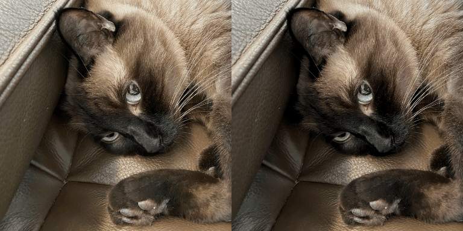
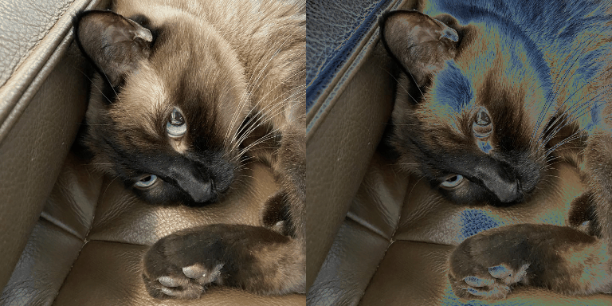

# Blur
```python
Blur(always_apply=False, p=1, blur_limit=(3, 7))
```

# CLAHE
```python
CLAHE(always_apply=False, p=1, clip_limit=(1, 4.0), tile_grid_size=(8, 8))
```

# ChannelDropout
```python
ChannelDropout(always_apply=False, p=1, channel_drop_range=(1, 1), fill_value=0)
```

# ChannelShuffle
```python
ChannelShuffle(always_apply=False, p=1)
```

# ColorJitter
```python
ColorJitter(always_apply=False, p=1, brightness=[0.8, 1.2], contrast=[0.8, 1.2], saturation=[0.8, 1.2], hue=[-0.2, 0.2])
```

# Downscale
```python
Downscale(always_apply=False, p=1, scale_min=0.25, scale_max=0.25, interpolation=0)
```

# Equalize
```python
Equalize(always_apply=False, p=1, mode='cv', by_channels=True)
```

# FDA
```python
FDA(always_apply=False, p=1, reference_images=[array([[[145, 148, 132],
        [140, 143, 128],
        [126, 128, 116],
        ...,
        [112, 119, 106],
        [114, 121, 106],
        [114, 121, 106]],

       [[146, 149, 133],
        [142, 145, 130],
        [127, 131, 119],
        ...,
        [110, 117, 105],
        [114, 120, 105],
        [116, 121, 106]],

       [[144, 151, 134],
        [141, 146, 129],
        [131, 132, 120],
        ...,
        [110, 114, 102],
        [114, 118, 105],
        [115, 120, 105]],

       ...,

       [[ 57,  27,  16],
        [ 63,  28,  18],
        [ 58,  28,  17],
        ...,
        [ 63,  70,  73],
        [ 64,  71,  74],
        [ 62,  72,  72]],

       [[ 61,  30,  18],
        [ 61,  29,  18],
        [ 60,  28,  15],
        ...,
        [ 63,  70,  73],
        [ 61,  69,  69],
        [ 63,  71,  71]],

       [[ 57,  25,  14],
        [ 60,  28,  17],
        [ 60,  30,  19],
        ...,
        [ 64,  72,  71],
        [ 61,  68,  71],
        [ 60,  68,  68]]], dtype=uint8)], beta_limit=(0, 0.1), read_fn=<function <lambda> at 0x0000022D9C476310>)
```

# FancyPCA
```python
FancyPCA(always_apply=False, p=1, alpha=0.1)
```

# GaussNoise
```python
GaussNoise(always_apply=False, p=1, var_limit=(10.0, 50.0))
```

# GaussianBlur
```python
GaussianBlur(always_apply=False, p=1, blur_limit=(3, 7), sigma_limit=(0, 0))
```

# GlassBlur
```python
GlassBlur(always_apply=False, p=1, sigma=0.7, max_delta=4, iterations=2)
```

# HistogramMatching
```python
HistogramMatching(always_apply=False, p=1, reference_images=[array([[[145, 148, 132],
        [140, 143, 128],
        [126, 128, 116],
        ...,
        [112, 119, 106],
        [114, 121, 106],
        [114, 121, 106]],

       [[146, 149, 133],
        [142, 145, 130],
        [127, 131, 119],
        ...,
        [110, 117, 105],
        [114, 120, 105],
        [116, 121, 106]],

       [[144, 151, 134],
        [141, 146, 129],
        [131, 132, 120],
        ...,
        [110, 114, 102],
        [114, 118, 105],
        [115, 120, 105]],

       ...,

       [[ 57,  27,  16],
        [ 63,  28,  18],
        [ 58,  28,  17],
        ...,
        [ 63,  70,  73],
        [ 64,  71,  74],
        [ 62,  72,  72]],

       [[ 61,  30,  18],
        [ 61,  29,  18],
        [ 60,  28,  15],
        ...,
        [ 63,  70,  73],
        [ 61,  69,  69],
        [ 63,  71,  71]],

       [[ 57,  25,  14],
        [ 60,  28,  17],
        [ 60,  30,  19],
        ...,
        [ 64,  72,  71],
        [ 61,  68,  71],
        [ 60,  68,  68]]], dtype=uint8)], blend_ratio=(0.5, 1.0), read_fn=<function <lambda> at 0x0000022DCBE82430>)
```

# HueSaturationValue
```python
HueSaturationValue(always_apply=False, p=1, hue_shift_limit=(-20, 20), sat_shift_limit=(-30, 30), val_shift_limit=(-20, 20))
```

# IAAAdditiveGaussianNoise
```python
IAAAdditiveGaussianNoise(always_apply=False, p=1, loc=0, scale=(2.5500000000000003, 12.75), per_channel=False)
```

# IAAEmboss
```python
IAAEmboss(always_apply=False, p=1, alpha=(0.2, 0.5), strength=(0.2, 0.7))
```

# IAAEmboss
```python
IAAEmboss(always_apply=False, p=1, alpha=(0.2, 0.5), strength=(0.2, 0.7))
```

# IAASharpen
```python
IAASharpen(always_apply=False, p=1, alpha=(0.2, 0.5), lightness=(0.5, 1.0))
```

# IAASuperpixels
```python
IAASuperpixels(always_apply=False, p=1, p_replace=0.1, n_segments=100)
```

# ISONoise
```python
ISONoise(always_apply=False, p=1, intensity=(0.1, 0.5), color_shift=(0.01, 0.05))
```

# InvertImg
```python
InvertImg(always_apply=False, p=1)
```

# MedianBlur
```python
MedianBlur(always_apply=False, p=1, blur_limit=(3, 7))
```

# MotionBlur
```python
MotionBlur(always_apply=False, p=1, blur_limit=(3, 7))
```

# MultiplicativeNoise
```python
MultiplicativeNoise(always_apply=False, p=1, multiplier=(0.9, 1.1), per_channel=False, elementwise=False)
```

# Posterize
```python
Posterize(always_apply=False, p=1, num_bits=(4, 4))
```

# RGBShift
```python
RGBShift(always_apply=False, p=1, r_shift_limit=(-20, 20), g_shift_limit=(-20, 20), b_shift_limit=(-20, 20))
```

# RandomBrightnessContrast
```python
RandomBrightnessContrast(always_apply=False, p=1, brightness_limit=(-0.2, 0.2), contrast_limit=(-0.2, 0.2), brightness_by_max=True)
```

# RandomFog
```python
RandomFog(always_apply=False, p=1, fog_coef_lower=0.3, fog_coef_upper=1, alpha_coef=0.08)
```

# RandomGamma
```python
RandomGamma(always_apply=False, p=1, gamma_limit=(80, 120), eps=None)
```

# RandomRain
```python
RandomRain(always_apply=False, p=1, slant_lower=-10, slant_upper=10, drop_length=20, drop_width=1, drop_color=(200, 200, 200), blur_value=7, brightness_coefficient=0.7, rain_type=None)
```

# RandomShadow
```python
RandomShadow(always_apply=False, p=1, shadow_roi=(0, 0.5, 1, 1), num_shadows_lower=1, num_shadows_upper=2, shadow_dimension=5)
```

# RandomSnow
```python
RandomSnow(always_apply=False, p=1, snow_point_lower=0.1, snow_point_upper=0.3, brightness_coeff=2.5)
```

# RandomSunFlare
```python
RandomSunFlare(always_apply=False, p=1, flare_roi=(0, 0, 1, 0.5), angle_lower=0, angle_upper=1, num_flare_circles_lower=6, num_flare_circles_upper=10, src_radius=400, src_color=(255, 255, 255))
```

# Solarize
```python
Solarize(always_apply=False, p=1, threshold=(128, 128))
```

# ToGray
```python
ToGray(always_apply=False, p=1)
```

# ToSepia
```python
ToSepia(always_apply=False, p=1)
```

# CenterCrop
```python
CenterCrop(always_apply=False, p=1, height=256, width=256)
```

# CoarseDropout
```python
CoarseDropout(always_apply=False, p=1, max_holes=8, max_height=8, max_width=8, min_holes=8, min_height=8, min_width=8, fill_value=0, mask_fill_value=None)
```

# Crop
```python
Crop(always_apply=False, p=1, x_min=0, y_min=0, x_max=256, y_max=256)
```

# ElasticTransform
```python
ElasticTransform(always_apply=False, p=1, alpha=1, sigma=50, alpha_affine=50, interpolation=1, border_mode=4, value=None, mask_value=None, approximate=False)
```

# Flip
```python
Flip(always_apply=False, p=1)
```

# GridDistortion
```python
GridDistortion(always_apply=False, p=1, num_steps=5, distort_limit=(-0.3, 0.3), interpolation=1, border_mode=4, value=None, mask_value=None)
```

# GridDropout
```python
GridDropout(always_apply=False, p=1, ratio=0.5, unit_size_min=None, unit_size_max=None, holes_number_x=None, holes_number_y=None, shift_x=0, shift_y=0, mask_fill_value=None, random_offset=False)
```

# HorizontalFlip
```python
HorizontalFlip(always_apply=False, p=1)
```

# IAAAffine
```python
IAAAffine(always_apply=False, p=1, scale=(1.0, 1.0), translate_percent=None, translate_px=None, rotate=(-0.0, 0.0), shear=(-0.0, 0.0), order=1, cval=0, mode='reflect')
```

# IAACropAndPad
```python
IAACropAndPad(always_apply=False, p=1, px=None, percent=None, pad_mode='constant', pad_cval=0, keep_size=True)
```

# IAAFliplr
```python
IAAFliplr(always_apply=False, p=1)
```

# IAAFlipud
```python
IAAFlipud(always_apply=False, p=1)
```

# IAAPerspective
```python
IAAPerspective(always_apply=False, p=1, scale=(0.05, 0.1), keep_size=True)
```

# IAAPiecewiseAffine
```python
IAAPiecewiseAffine(always_apply=False, p=1, scale=(0.03, 0.05), nb_rows=4, nb_cols=4, order=1, cval=0, mode='constant')
```

# OpticalDistortion
```python
OpticalDistortion(always_apply=False, p=1, distort_limit=(-0.05, 0.05), shift_limit=(-0.05, 0.05), interpolation=1, border_mode=4, value=None, mask_value=None)
```

# PadIfNeeded
```python
PadIfNeeded(always_apply=False, p=1, min_height=256, min_width=256, pad_height_divisor=None, pad_width_divisor=None, border_mode=4, value=None, mask_value=None)
```

# RandomCrop
```python
RandomCrop(always_apply=False, p=1, height=256, width=256)
```

# RandomGridShuffle
```python
RandomGridShuffle(always_apply=False, p=1, grid=(3, 3))
```

# RandomResizedCrop
```python
RandomResizedCrop(always_apply=False, p=1, height=256, width=256, scale=(0.08, 1.0), ratio=(0.75, 1.3333333333333333), interpolation=1)
```

# RandomRotate90
```python
RandomRotate90(always_apply=False, p=1)
```

# RandomSizedCrop
```python
RandomSizedCrop(always_apply=False, p=1, min_max_height=(256, 384), height=256, width=256, w2h_ratio=1.0, interpolation=1)
```

# Resize
```python
Resize(always_apply=False, p=1, height=256, width=256, interpolation=1)
```

# Rotate
```python
Rotate(always_apply=False, p=1, limit=(-90, 90), interpolation=1, border_mode=4, value=None, mask_value=None)
```

# ShiftScaleRotate
```python
ShiftScaleRotate(always_apply=False, p=1, shift_limit_x=(-0.0625, 0.0625), shift_limit_y=(-0.0625, 0.0625), scale_limit=(-0.09999999999999998, 0.10000000000000009), rotate_limit=(-45, 45), interpolation=1, border_mode=4, value=None, mask_value=None)
```

# Transpose
```python
Transpose(always_apply=False, p=1)
```

# VerticalFlip
```python
VerticalFlip(always_apply=False, p=1)
```

