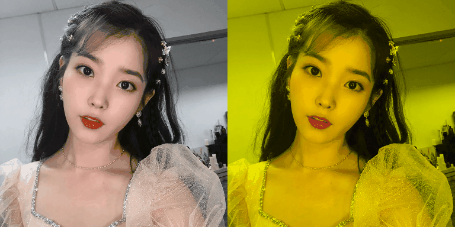
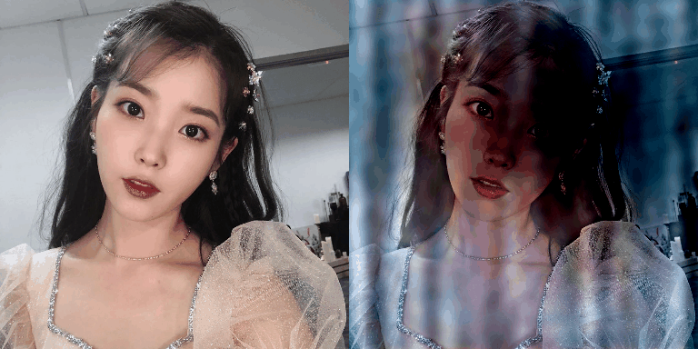
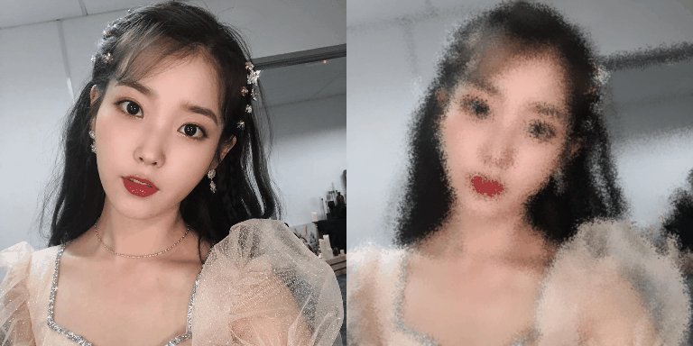
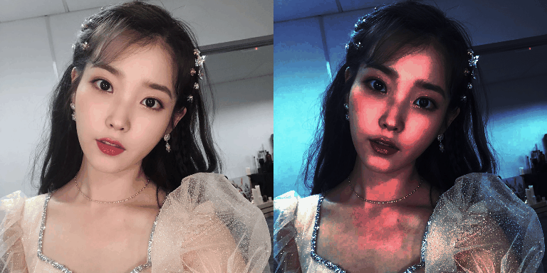
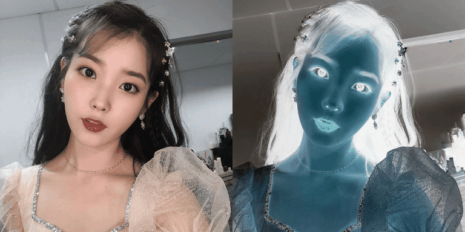
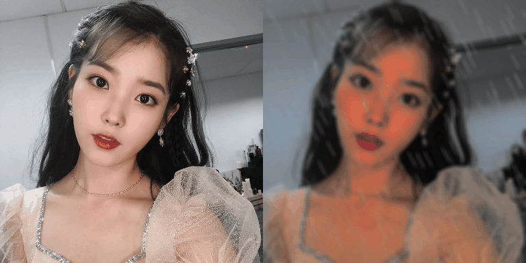
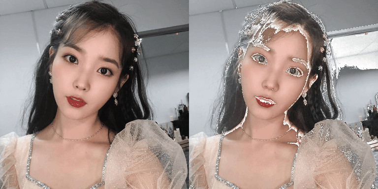
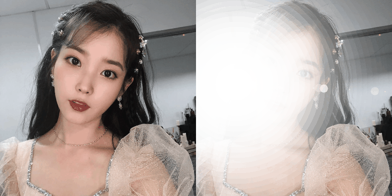
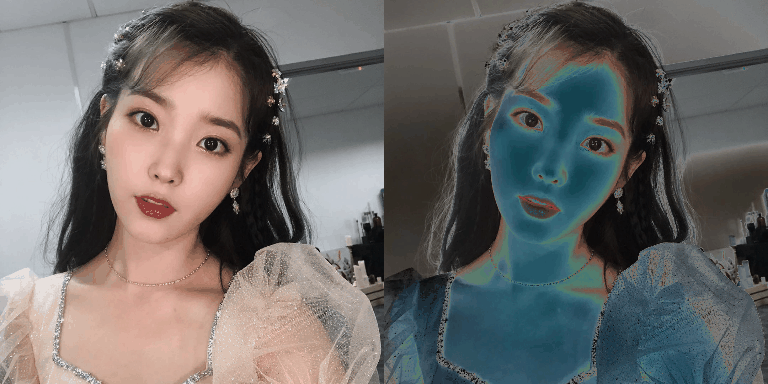
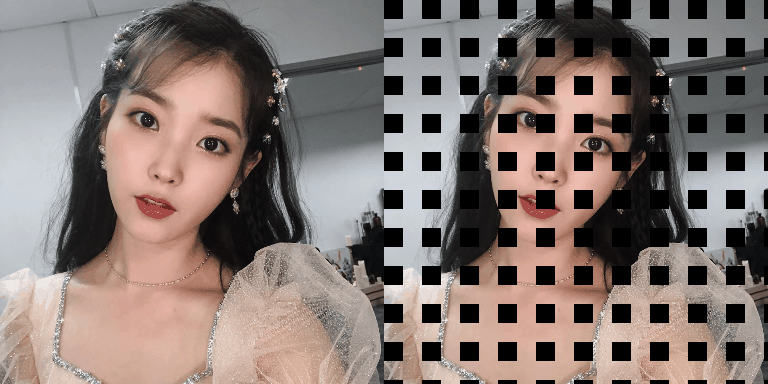

# Blur

# CLAHE

# ChannelDropout

# ChannelShuffle

# ColorJitter

# Downscale

# Equalize

# FDA

# FancyPCA

# GaussNoise

# GaussianBlur

# GlassBlur

# HistogramMatching

# HueSaturationValue

# IAAAdditiveGaussianNoise

# IAAEmboss

# IAAEmboss

# IAASharpen

# IAASuperpixels

# ISONoise

# InvertImg

# MedianBlur

# MotionBlur

# MultiplicativeNoise

# Posterize

# RGBShift

# RandomBrightnessContrast

# RandomFog

# RandomGamma

# RandomRain

# RandomShadow

# RandomSnow

# RandomSunFlare

# Solarize

# ToGray

# ToSepia

# CenterCrop

# CoarseDropout

# Crop

# ElasticTransform

# Flip

# GridDistortion

# GridDropout

# HorizontalFlip

# IAAAffine

# IAACropAndPad

# IAAFliplr

# IAAFlipud

# IAAPerspective

# IAAPiecewiseAffine

# OpticalDistortion

# PadIfNeeded

# RandomCrop

# RandomGridShuffle

# RandomResizedCrop

# RandomRotate90

# RandomSizedCrop

# Resize

# Rotate

# ShiftScaleRotate

# Transpose

# VerticalFlip

